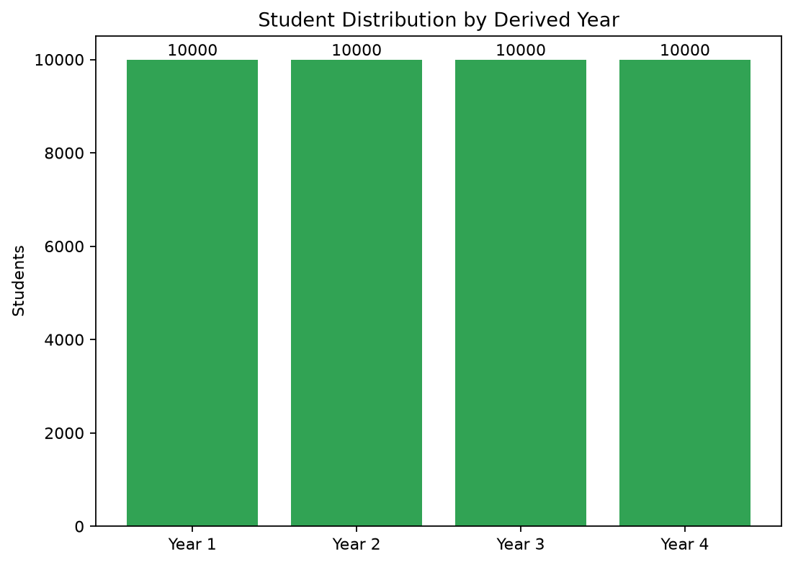
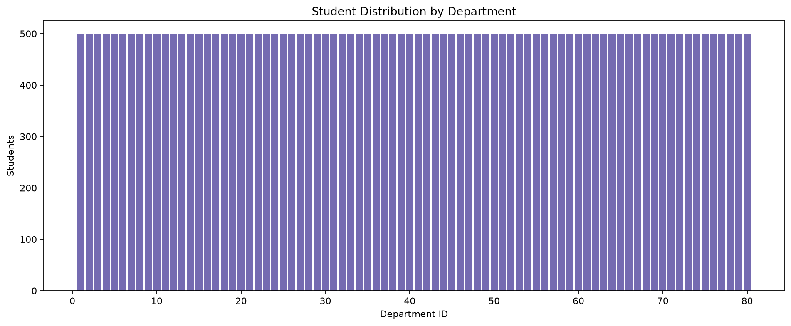

# Data Distribution Validation

## Student year distribution

| Derived year | Students |
|---:|---:|
| 1 | 10,000 |
| 2 | 10,000 |
| 3 | 10,000 |
| 4 | 10,000 |

> Source: derived from student_id for analysis only; not persisted in the JPA entity

## Department distribution

- Departments: 80
- Minimum students per department: 500
- Maximum students per department: 500

