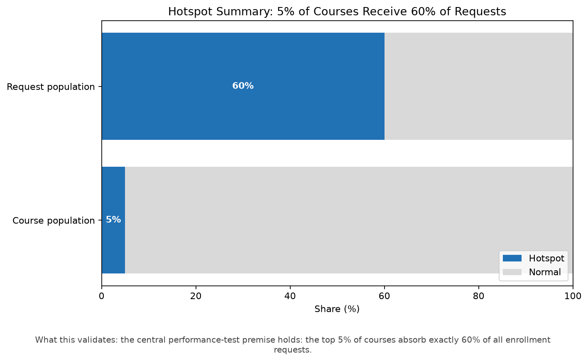
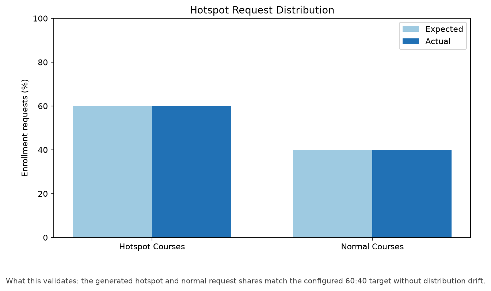

# Hotspot Validation

Result: **PASS**

| Metric | Expected | Actual |
|---|---:|---:|
| Total courses | 4,000 | 4,000 |
| Hotspot courses | 5.00% | 200 (5.00%) |
| Total requests | 80,000 | 80,000 |
| Hotspot requests | 60.00% | 48,000 (60.00%) |

## Performance-test design charts

