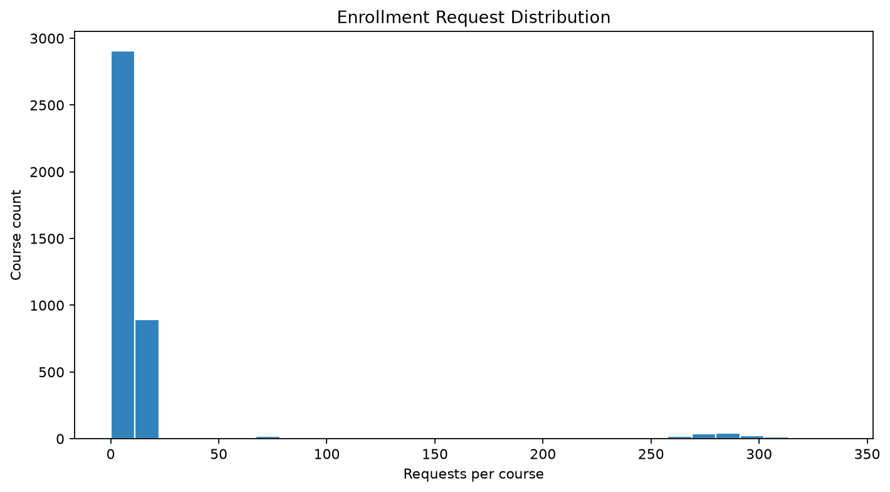

# Mock Data Harness Summary

Overall: **PASS**

## Generated scale

| Dataset | Rows |
|---|---:|
| `department` | 80 |
| `member` | 40,000 |
| `course` | 4,000 |
| `student` | 40,000 |
| `course_time` | 4,000 |
| `prerequisite` | 800 |
| `completed_course` | 200,000 |
| `enrollment` | 0 |
| `enrollment_payload` | 80,000 |

## Validation results

- Domain validation failures: 0
- Payload validation failures: 0
- Invalid prerequisite scenarios: 0
- Invalid time-conflict scenarios: 0
- Credit validation: NOT_APPLICABLE
- Total actionable failures: 0

## Key distributions

- Hotspot courses: 200/4,000 (5.00%)
- Hotspot requests: 48,000/80,000 (60.00%)
- Prerequisite failure scenarios verified: 3,200
- Time-conflict scenarios verified: 3,200

## Reports

- [Core validation](validation_report.md)
- [Payload validation](payload_report.md)
- [Hotspot](hotspot_report.md)
- [Prerequisite](prerequisite_report.md)
- [Schedule](schedule_report.md)
- [Credit](credit_report.md)
- [Distribution](distribution_report.md)

## Charts

