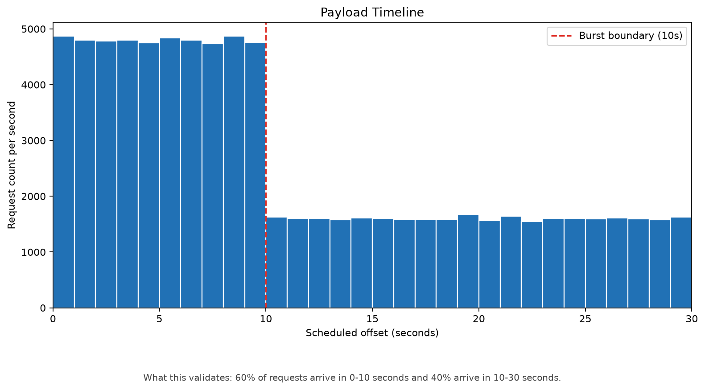
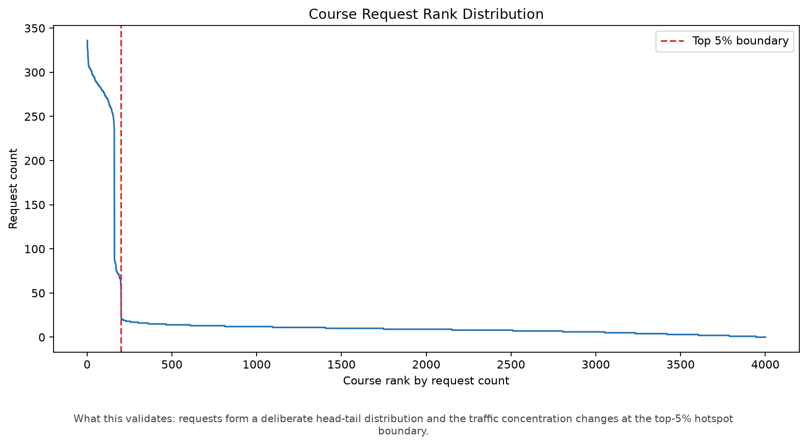
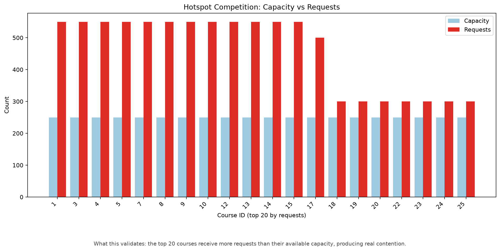
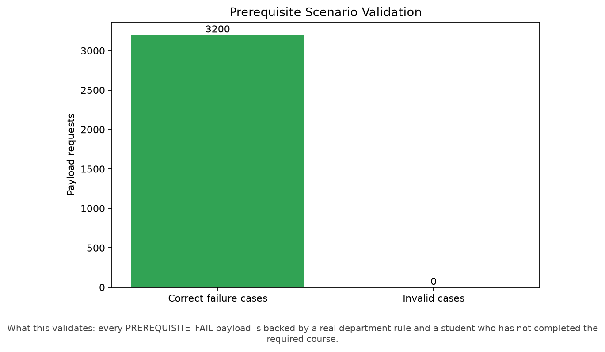
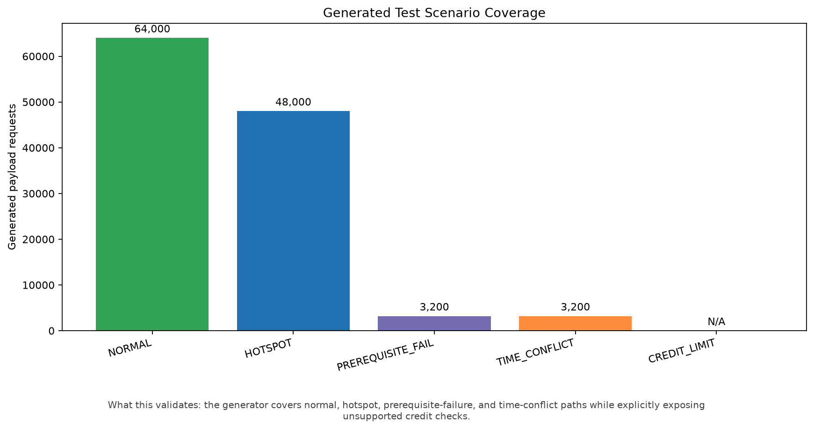
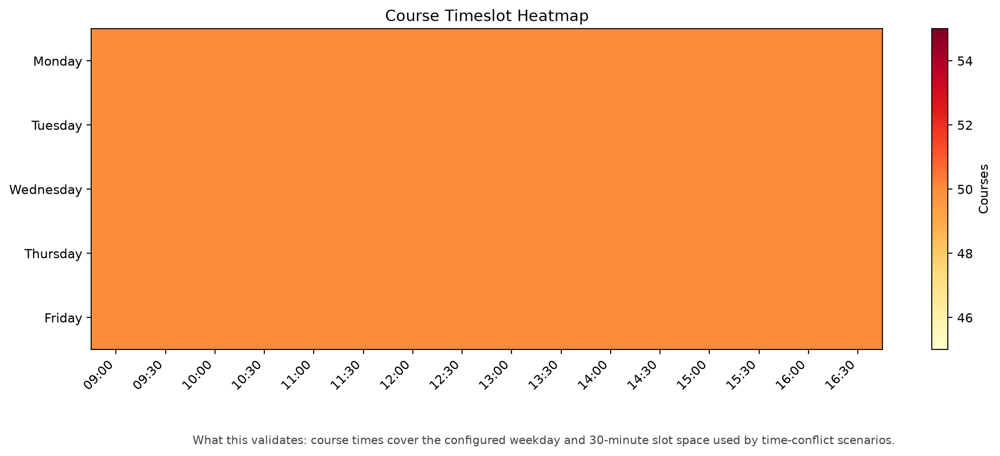
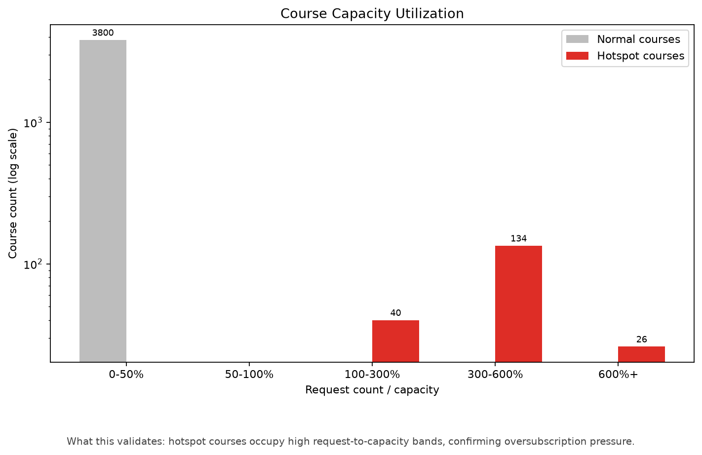
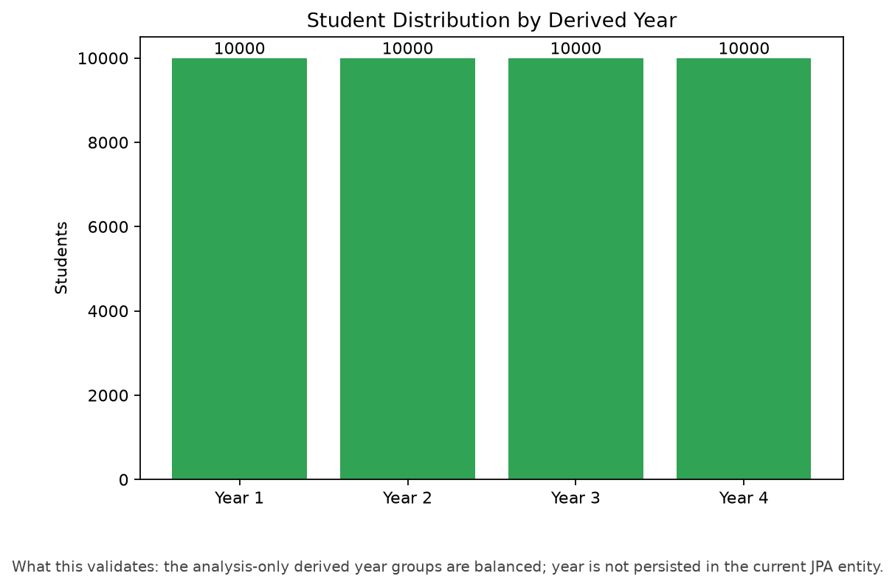
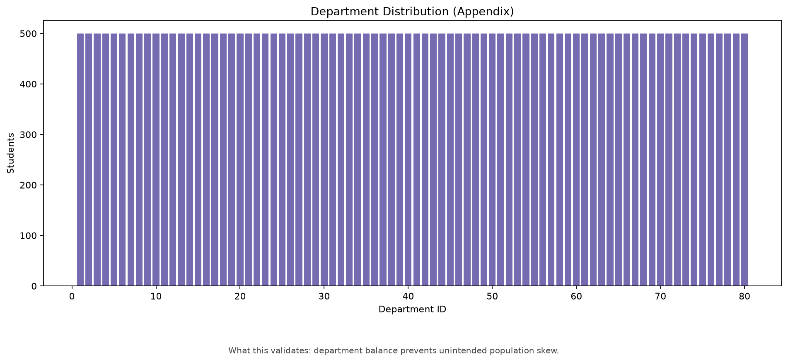

# Mock Data Harness Summary

Overall: **FAIL**

## Generated scale

| Dataset | Rows |
|---|---:|
| `department` | 80 |
| `member` | 40,000 |
| `course` | 4,000 |
| `student` | 40,000 |
| `course_time` | 4,000 |
| `prerequisite` | 800 |
| `completed_course` | 200,000 |
| `enrollment` | 0 |
| `enrollment_payload` | 80,000 |

## Validation results

- Domain validation failures: 0
- Payload validation failures: 5
- Invalid prerequisite scenarios: 0
- Invalid time-conflict scenarios: 0
- Credit validation: NOT_APPLICABLE
- Validation rule failures: 5
- Total actionable failures: 41,090

## Payload integrity validation

- Payload duplicate count: 232
- Invalid NORMAL count: 32,455
- Invalid CAPACITY_OVER count: 3,947
- Invalid DUPLICATE count: 2,406
- Invalid TIME_CONFLICT count: 2,050
- Invalid PREREQUISITE_FAIL count: 0
- Scenario label inconsistency count: 0
- Payload actionable failures: 41,090

## Key distributions

- Hotspot courses: 200/4,000 (5.00%)
- Hotspot requests: 48,000/80,000 (60.00%)
- Prerequisite failure scenarios verified: 3,200
- Time-conflict scenarios verified: 3,200

## Reports

- [Core validation](validation_report.md)
- [Payload validation](payload_report.md)
- [Payload integrity](payload_integrity_report.md)
- [Duplicate payload](duplicate_payload_report.md)
- [NORMAL payload validation](normal_payload_validation_report.md)
- [CAPACITY_OVER validation](capacity_over_validation_report.md)
- [DUPLICATE scenario validation](duplicate_scenario_validation_report.md)
- [TIME_CONFLICT validation](time_conflict_validation_report.md)
- [PREREQUISITE_FAIL validation](prerequisite_payload_validation_report.md)
- [Scenario label consistency](scenario_label_consistency_report.md)
- [Hotspot](hotspot_report.md)
- [Prerequisite](prerequisite_report.md)
- [Schedule](schedule_report.md)
- [Credit](credit_report.md)
- [Distribution](distribution_report.md)

## Portfolio charts

### Payload Timeline

- 파일: `payload_timeline.png`
- 목적: 0~30초 요청 분포가 의도한 burst traffic을 형성하는지 검증
- 해석: 0~10초 요청 비율은 60.0%이며 설정값 60.0%와 일치함
- 결과: **PASS**

### Course Request Rank Distribution

- 파일: `course_request_rank_distribution.png`
- 목적: 상위 5% 과목에 요청이 집중되고 Hotspot/Normal 경계가 분리되는지 검증
- 해석: Rank 200 경계에서 최소 hotspot 요청 56건, 최대 normal 요청 26건으로 급격한 감소가 확인됨
- 결과: **PASS**

### Hotspot Competition

- 파일: `hotspot_competition.png`
- 목적: 상위 20개 인기 과목이 정원을 초과하는 경쟁 상태인지 검증
- 해석: 상위 20개 과목의 요청은 평균 정원의 6.2배이며 모두 정원을 초과함
- 결과: **PASS**

### Prerequisite Validation

- 파일: `prerequisite_validation.png`
- 목적: PREREQUISITE_FAIL 요청이 실제 선수과목 미이수 상태인지 검증
- 해석: 대상 3,200건 중 3,200건이 의도한 실패 조건을 충족하고 잘못 생성된 요청은 0건임
- 결과: **PASS**

### Generated Test Scenario Coverage

- 파일: `validation_coverage.png`
- 목적: 성능·도메인 테스트에 필요한 주요 시나리오가 실제 payload에 포함되었는지 검증
- 해석: NORMAL 64,000건, HOTSPOT 48,000건, 선수과목/시간충돌 각 3,200/3,200건이며 CREDIT_LIMIT은 엔티티 제약으로 N/A
- 결과: **PASS**

### Timeslot Heatmap

- 파일: `timeslot_heatmap.png`
- 목적: 실제 대학 시간표처럼 10~12시와 13~15시에 강의가 집중되는지 검증
- 해석: 피크 시간대 슬롯당 평균 84.6개, 비피크 시간대 20.5개로 피크 집중도가 더 높음
- 결과: **PASS**

### Course Capacity Utilization

- 파일: `course_capacity_utilization.png`
- 목적: 강의별 요청 수/정원 비율과 hotspot 과목의 초과 경쟁 상태를 검증
- 해석: Hotspot 200개 중 200개가 정원 대비 100% 이상의 요청을 받아 초과 경쟁 상태임
- 결과: **PASS**

## Appendix: population distribution

